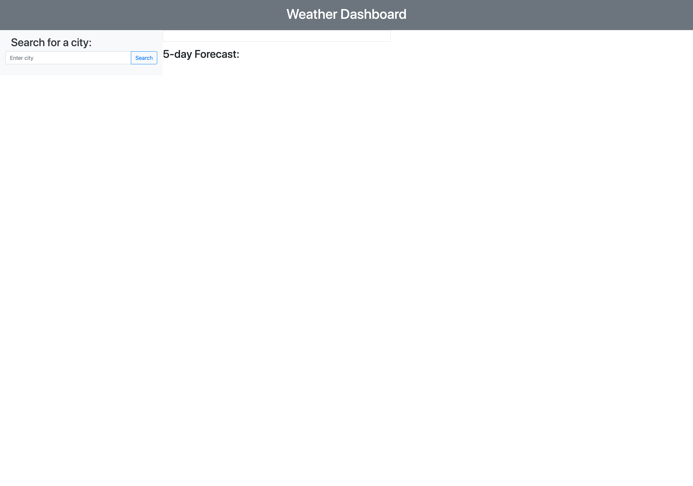
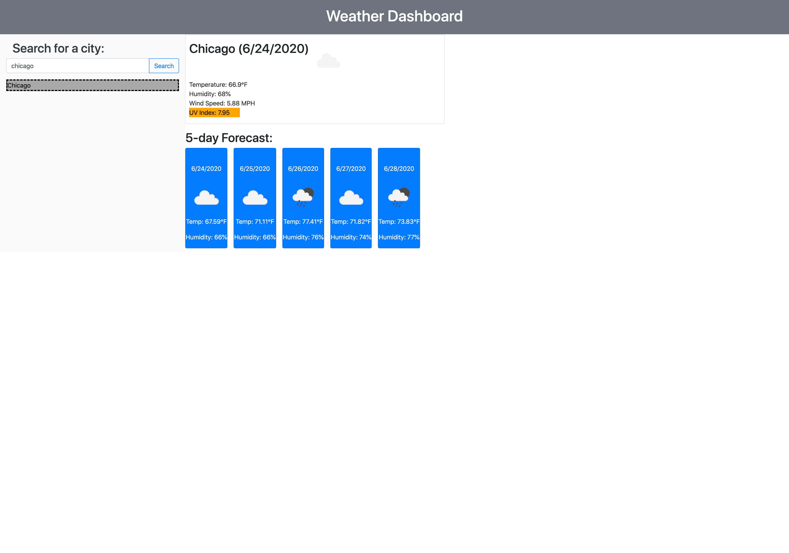

# weather-dashboard

This application displays a 5-day weather forecast for multiple cities.

    -The user may enter a city they would like a 5-day weather forecast for.

    -WHEN the user enters a city and CLICKS 'search', they are presented with the following:
        -The current weather
            -The current date, temperature, humidity, wind speed, UV Index, and weather icon. The UV Index is color coated depending on whether it is categorized as low, medium, or high.

        -A 5-day forecast
            -The date for the next five days, a weather icon, the projected temperature and humidity.

        -The previous city they searched appears below the input box.
            -The previous city is saved in the user's local storage.

See URL for demo: https://meierj423.github.io/weather-dashboard/

    

    
